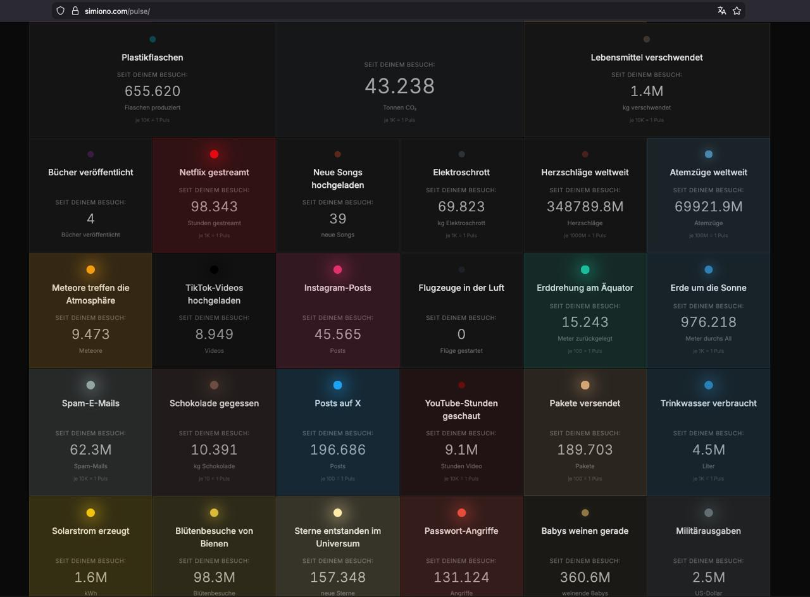

# Pulse of the World

**Feel the numbers.**

A web experience that makes global statistics visceral. A grid of cells, each pulsing at the rhythm of real-world events — births, deaths, deforestation, CO₂ emissions. No charts. No axes. Just a heartbeat for every metric that matters.

**[→ Try it live](https://simiono.com/pulse/)** · **[Read the essay](https://simiono.com/Pulse-of-the-World.html)**



## The Idea

Abstract numbers are hard to grasp. *4.2 births per second* means nothing until you see a cell pulse every 238 milliseconds. *2 deaths per second* — a slower, heavier beat. Side by side, they tell a story no bar chart can.

Each cell in the grid represents one global metric. The grid is alive. Every cell breathes at its own frequency. The viewer doesn't read — they *feel*.

## Features

- **57 metrics** across 6 categories: Life & Death, Technology, Fun, Economy, Culture, Transport
- **Real-time counters** — shows accumulation since your visit
- **Pulse indicators** — colored dots beat at the actual rate of each event
- **Category filtering** — filter by Leben, Technologie, Fun, Wirtschaft, Kultur, Verkehr
- **3 visual themes** — Neon (default), Mono, Terminal
- **Light / Dark mode** — respects system preference, toggleable
- **Responsive grid** — 6 → 4 → 2 columns, from projector wall to phone
- **PWA** — installable, works offline via service worker
- **Zero dependencies** — vanilla HTML, CSS, JS

## Getting Started

### Prerequisites

- A modern web browser (for running the app)
- [Node.js](https://nodejs.org/) 18+ (for running tests)

### Run Locally

```bash
# Clone the repository
git clone https://github.com/utrost/PulseOfTheWorld.git
cd PulseOfTheWorld

# Open in browser — no build step needed
open index.html
# or use a local server:
npx serve .
```

### Run Tests

```bash
npm install
npm test
```

## Project Structure

```
PulseOfTheWorld/
├── index.html              # Entry point
├── css/style.css           # Styling, themes, responsive grid
├── js/
│   ├── pulse.js            # Main app: grid, animation loop, theming
│   └── metrics.js          # Utility: number formatting, pulse math
├── data/metrics.json       # 57 sourced global metrics
├── sw.js                   # Service worker for offline support
├── manifest.json           # PWA manifest
├── tests/
│   ├── metrics.test.js     # Unit tests for formatting & calculations
│   ├── data.test.js        # Data integrity validation
│   ├── html.test.js        # HTML structure validation
│   ├── sw.test.js          # Service worker configuration tests
│   └── pulse-logic.test.js # Pulse interval & counter logic tests
├── docs/metrics.md         # Metrics research & source documentation
├── CONTRIBUTING.md         # Contribution guidelines
└── .github/workflows/ci.yml  # CI pipeline (lint + test)
```

## How It Works

1. **Data** — `metrics.json` defines each metric with a `ratePerSecond` (events per second) and `pulseUnit` (how many events per pulse).
2. **Pulse interval** — Calculated as `pulseUnit / ratePerSecond`. A metric with 4.2 events/sec and pulseUnit 1 pulses every ~238ms.
3. **Animation loop** — `requestAnimationFrame` drives a 60fps `tick()` that updates counters and fires pulse animations when intervals elapse.
4. **Scaling** — Large rates use bigger pulse units (1K, 1M) to keep visual frequency in the perceptible 200ms–5s range.

## Design Principles

- **Minimal.** Black background. Cells as colored squares. Nothing else.
- **No interaction required.** Works as a passive display, a lobby installation, a screensaver.
- **Data-honest.** Every pulse maps to a real, sourced number. No dramatization.

## Data Sources

All metrics are sourced from public data: UN, WHO, World Bank, Our World in Data, NASA, and more. Each metric includes its source and a link to the original data. See [docs/metrics.md](docs/metrics.md) for detailed research notes.

## Tech Stack

- Vanilla HTML/CSS/JS — no framework, no build step
- CSS custom properties for theming
- Service worker for offline caching
- Vitest for testing
- GitHub Actions for CI

## Roadmap

- [x] 57 metrics with verified sources
- [x] Grid layout with responsive scaling
- [x] Color palette (each metric category gets a hue)
- [x] Real-time counters with formatted numbers
- [x] Category filtering
- [x] 3 visual themes (Neon, Mono, Terminal) + light/dark mode
- [x] PWA support (offline, installable)
- [x] Test suite + CI pipeline
- [x] Deploy to simiono.com/pulse/
- [ ] Data source attribution overlay
- [ ] Optional: ambient sound layer (subtle heartbeat per cell)
- [ ] Metric detail view on click/tap

## Philosophy

> We drown in numbers. This project doesn't add more — it translates them into something the body understands.

## License

AGPL-3.0 — see [LICENSE](LICENSE).

## Author

[simiono](https://simiono.com) · Uwe Trostheide
